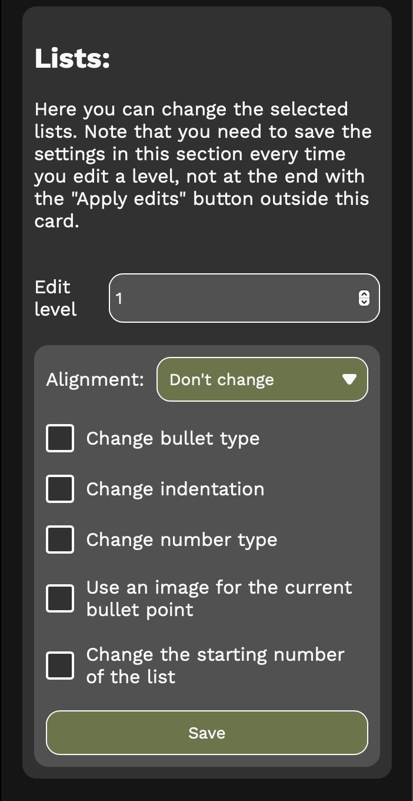

# custom-word-styling

Create custom stylings, edit the built-in ones and update paragraphs on Microsoft Word, both from desktop devices, on the Web and on iPad.

<video autoplay muted height="300" src="./src/assets/PresentationVideo.mp4"></video>

## Installation:

You'll need to sideload this extension by downloading the [CustomWordStyling.xml file](./CustomWordStyling.xml). You can find more info on how to do it on the [custom-word-style's website](https://dinoosauro.github.io/custom-word-styling). 

## Usage

The extension has five different sections:

### Change styles

You can edit the built-in styles or create new, custom ones. Here you can edit all the:
- Font properties (ex: font size, font name, bold/italic etc.)
- Paragraph properties (space before/after the paragraph, alignment etc.)
- Border options (color, width, type etc.)
- Shading properties (basically, fancy background colors)
- List options (bullet point or numbers, custom formatting, custom image etc.)
- Table options (ex: cell spacing)

You can actually change A LOT of properties. Feel free to stop the video above to see them all. Note also that you can change other lists options by manually selecting the list and using the `Change selection` section.

### Apply styles
You can apply a style to the selected text on Word. A dropdown menu will appear with all the styles you've added to the document.

### Change selection

You can update the font options, the paragraph options and the list options of the paragraph you've selected, without adding a new style. Note that Word permits to edit other list proprieties here that normally aren't available on list styles: you can, for example, change the nubmer formatting (ex: from `1)` to `1:`), change the bullet point style (and also add a custom character as bullet point), change the indentation, change the starting number of the list and also using a custom image for the bullet point.

### Export styles

You can export one or more styles to a JSON file. A list with all the styles embedded in a document will appear, and you can select which elements to export. The file will be downloaded by opening a webpage in your browser. If this isn't possible, a link with the page to download the content will be copied in the clipboard (but you'll be notified about that). The downloads are always kept private - nothing is sent to an external server.

### Import styles

Finally, you can also import styles from a JSON file. You can choose if you want to overwrite the already existing styles, to ignore them, or to keep both the original style and the new one from the JSON file.

## Why this project
I decided to make this project for two reasons:
- I wanted to learn the Office.JS API so that I can automate a little bit of things while taking notes on Word;
- Word on iPad feels a little bit limited compared to the macOS version. Therefore, this add-in aims to narrow the gap between these two versions.

_Obviously_, this project is in no way affiliated with Microsoft.